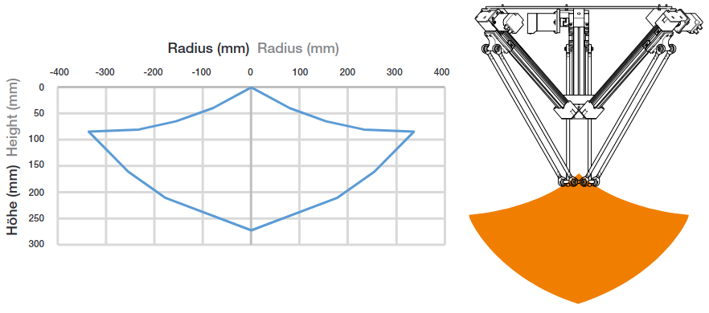
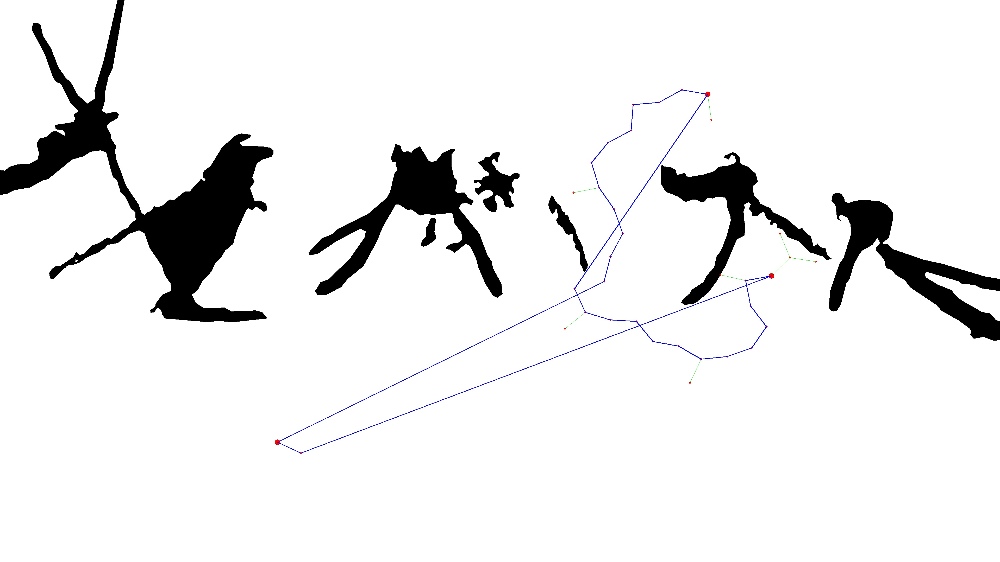

## Delta Robot

The delta robot is an IGUS robot. It is designed for high-speed, precision tasks and can reach a maximum height as illustrated in the image below.



## RRT Network

The code utilizes an RRT (Rapidly-exploring Random Tree) network for path planning. The RRT algorithm is particularly useful for solving complex path planning problems in high-dimensional spaces.



### How RRT Works

RRT works by randomly sampling points in the space and incrementally building a tree. Each new point is connected to the closest point in the tree, gradually expanding the tree until the goal is reached or a certain number of points have been added.

1. **Initialization**: Start with the initial position of the robot as the root of the tree.
2. **Sampling**: Randomly sample a point in the space.
3. **Nearest Neighbor**: Find the closest point in the tree to the sampled point.
4. **Steer**: Move from the nearest point towards the sampled point.
5. **Add to Tree**: Add the new point to the tree if it is valid (not in collision with obstacles).
6. **Check Goal**: Repeat until the goal is reached or the maximum number of iterations is exceeded.

## Path Optimize

The path optimization is handled inside `PathOptimize.py`, and the result is shown in the image below.


The red path is the calculated path by the rrt network. Which is reallly fuzzy and a lot of nodes. The green path is the optimized path with the least nodes as possible.
### What the Code Does

The `PathOptimize.py` script takes the initial path generated by the RRT and refines it to make it more efficient. This process involves:

1. **Loading the Image**: The environment or workspace is loaded from an image file.
2. **Optimize Path**: The initial path is analyzed and unnecessary waypoints are removed, smoothing the path while avoiding obstacles.
3. **Visualize Path**: Both the original and optimized paths are visualized for comparison.

## Using

To run the code, use the following command:

```bash
python main.py
```

If the robot is not connected, the software will still run, simulating the robot's actions. This allows for testing and debugging without requiring the actual hardware.