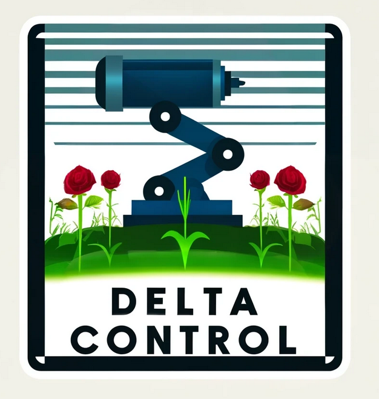
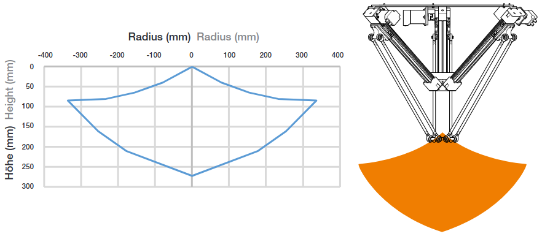
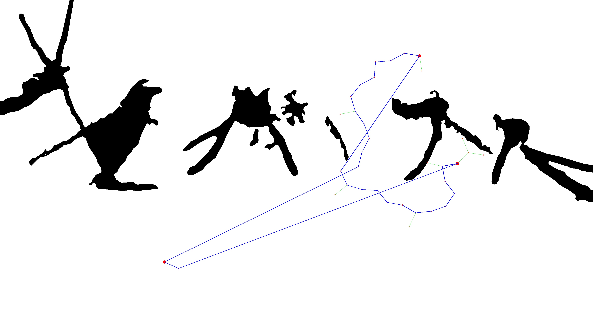

<div align="center">

# Minor A-Systems : Delta
</div>

<div align="center">
  <picture>
    
  </picture>
</div>
<br><br>

<div align="center">
  <a href="https://github.com/TimBaars/Delta/stargazers">
    
  </a>
  <a href="https://github.com/TimBaars/Delta/issues">
    
  </a>
  <a href="https://github.com/TimBaars/Delta/network/members">
    
  </a>
  <a href="https://www.gnu.org/licenses/gpl-3.0">
    
  </a>
</div>


<br><br>

<h1 align="center">Delta control for weed remover</h1>
<div align="center">
This research was conducted as part of the A-System minor at Fontys University of Applied Sciences. The project explores advancements in automated bell pepper detection, evaluating existing methods and investigating innovative techniques using AI technologies. The primary focus is on enhancing the precision and efficiency of bell pepper detection in automated harvesting systems.
</div>

## Table of Contents

- [Introduction](#introduction)
- [Delta Robot Igus Explained](#delta-robot-igus-explained)
- [Delta Robot Modbus Control](#delta-robot-modbus-control)
- [DeltaRobotDriver Class](#deltarobotdriver-class)
- [RTT Algorithm for Path Planning](#rtt-algorithm-for-path-planning)

## Introduction

This project focuses on utilizing an Igus Delta Robot for navigating a field filled with roses. The primary challenge addressed by the robot's navigation system is the identification and avoidance of roses during its traversal, ensuring that the plants remain undamaged while the robot performs its tasks efficiently.

## Delta Robot Igus Explained

The Igus Delta Robot is a lightweight, high-speed robotic arm designed for precision tasks. It stands out for its ability to perform quick and accurate movements, making it ideal for applications requiring delicate handling, such as navigating through a field of roses without causing damage. This robot utilizes a parallel kinematic system, which contributes to its agility and precision.

<p align="center">

<p>

## Delta Robot Modbus Control

For controlling the Igus Delta Robot, Modbus TCP communication is employed. Modbus, a widely used communication protocol in industrial environments, enables reliable and straightforward command and control over networked devices. By integrating Modbus TCP communication, we can remotely operate the delta robot, send movement commands, and receive feedback about its status and position in real-time.

## DeltaRobotDriver Class

The `DeltaRobotDriver` class is a custom Python class designed to encapsulate the functionality needed to control the delta robot using Modbus. It offers methods to drive the robot to specified locations, wait for the robot to reach these locations, and query its current position. This abstraction simplifies the robot control, making the development of higher-level navigation and path-planning algorithms more straightforward.

```python
class DeltaRobotDriver:
    def __init__(self, ip_address, port=502):
        pass

    def drive_to_location(self, x, y, z, velocity=None):
        pass

    def drive_to_location_and_wait(self, x, y, z, velocity=None):
        pass

    def get_current_position(self):
        pass

    def shutdown_robot(self):
        pass
```

## RTT Algorithm for Path Planning

To navigate around roses effectively, the Rapidly-exploring Random Tree (RTT) algorithm is employed for path planning. RTT is particularly suited for this application due to its efficiency in exploring high-dimensional spaces and its ability to quickly find feasible paths in complex environments. The algorithm incrementally builds a tree by randomly exploring the available space, steering clear.

<p align="center">

<p>